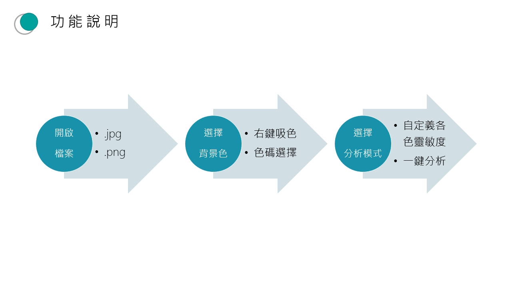
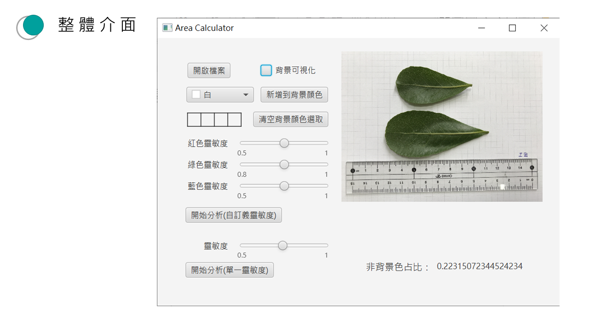
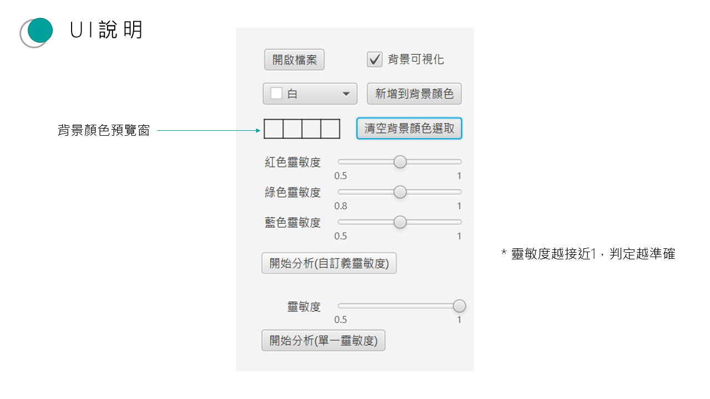

# Area Calculator

## 簡介
Area Calculator 是一款基於 JavaFX 的影像分析工具，可用來計算影像中非背景區域的比例。透過調整色彩靈敏度與背景顏色設定，使用者能夠精準地篩選分析目標區域。

## 功能
- **開啟圖片**：支援 `.jpg`、`.png` 格式的影像。
- **選擇背景色**：
  - 右鍵吸色
  - 手動輸入色碼
- **選擇分析模式**：
  - 自定義各色靈敏度
  - 一鍵分析

## 使用方式
1. **開啟影像檔案**
2. **設定背景顏色**
   - 使用右鍵吸取背景顏色，或手動選擇色碼
3. **調整靈敏度參數**
   - 設定紅、綠、藍三色的靈敏度，以提高分析準確度
4. **開始分析**
   - 選擇自定義靈敏度或單一靈敏度模式，進行計算

## UI 介面
### 功能流程

### 軟體主畫面

### UI 操作說明

## 開發技術
- Java 11 (jdk-11.0.16)
- JavaFX 17 (javafx-sdk-17.0.0.1)
